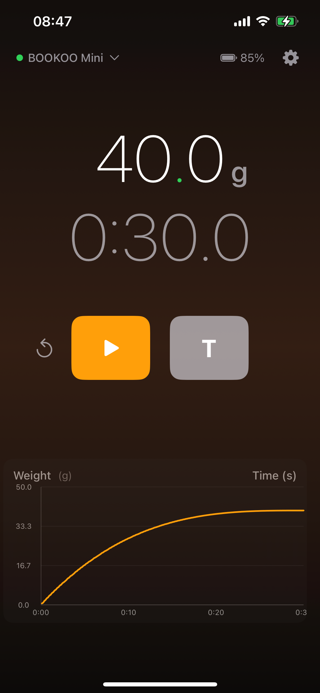
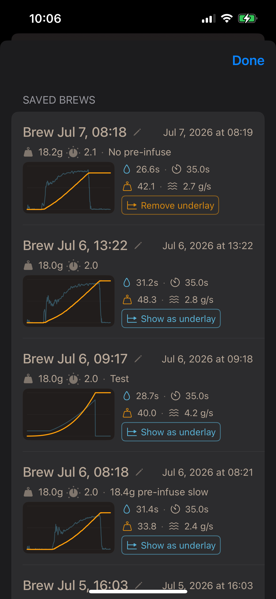

# booBud ☕ Simple is good.

The apps I found for the Bookoo scale were overcomplicated and awkward to use. I wanted something simple. So this is it — a straightforward iOS companion for your **Bookoo Mini Scale**: real-time weight, a brew timer, and tare controls over Bluetooth. Nothing more, nothing less.

## Features

- **BLE connection** to Bookoo Mini Scale (official protocol) with auto-reconnect
- **Live weight display** — grams or ounces, large readable digits
- **Brew timer** — start/stop/reset with 0.1s precision, or auto-start on pour detection
- **Tare & Brew button** — one tap to zero the scale and start the timer
- **Auto-detect pour** — optionally auto-starts the timer when weight crosses a configurable threshold
- **Real-time graph** — dual-axis chart of weight (g) and flow rate (g/s) over time
- **Flow-stop detection** — vertical dashed line + label marking when flow drops below threshold
- **Peak weight annotation** — horizontal dashed line at the maximum weight reached
- **Brew saving** — save each brew with auto-generated stats (duration, final weight, peak weight, peak flow)
- **Bean weight & grind setting** — stepper controls (step 0.1), last-used values retained for next brew
- **Brew history** — scrollable list with thumbnail charts, editable name/note/bean/grind, swipe to delete
- **Underlay comparison** — overlay a past brew's graph as dashed ghost lines behind the live data
- **Battery level** from the scale with low-battery color warnings (yellow ≤20%, red ≤10%)
- **Settings** — pour trigger threshold, flow axis auto-range or fixed max, flow-stop detection threshold
- **ScaleSimulator** — companion macOS app that simulates a Bookoo scale for testing

## Screenshots

| Weight Display | Brews | Splash Screen |
|---------------|-------|---------------|
|  |  |  |

## Requirements

- iOS 18.0+
- Xcode 16.0+
- A Bookoo Mini Scale (or compatible BLE scale)

## Install on Your iPhone (no App Store, no developer account)

1. Open `booBud.xcodeproj` in Xcode
2. Plug in your iPhone, select it from the device dropdown
3. Sign in with your Apple ID (Xcode → Settings → Accounts)
4. Press **⌘R** to build and install
5. On iPhone: Settings → General → VPN & Device Management → Trust your Apple ID

The app stays installed for 7 days — just rebuild to refresh.

## How It Works

booBud communicates with the Bookoo Mini Scale over Bluetooth Low Energy using the [official open-source protocol](https://github.com/BooKooCode/OpenSource):

- **Service UUID**: `0xFFE0` (primary)
- **Weight notifications**: characteristic `0xFF11` (20-byte packets with grams, flow rate, battery, timer)
- **Commands**: characteristic `0xFF12` (tare, timer start/stop/reset, mode switch)
- **Device Name**: characteristic `0xFF1E` (readable, used for authoritative display name)

## Project Structure

```
booBud/
├── App/              # @main app entry
├── BLE/              # BookooProtocol + ScaleBLEController
├── Models/           # WeightReading, WeightUnit, BrewTimerState, GraphPoint, SavedBrew, BrewStore
├── ViewModels/       # ScaleViewModel (@Observable state)
├── Views/            # ContentView, WeightDisplay, BrewTimer, Controls, DeviceDiscovery, Settings, BrewHistory, BrewThumbnail, BrewEditSheet
├── Resources/        # Info.plist (BLE permissions)
├── Assets.xcassets/  # App icon, accent color
└── scripts/          # bump-build-number.sh (auto-increment build number)

ScaleSimulator/
└── ScaleSimulator/   # macOS BLE peripheral companion — simulates a Bookoo scale for testing
```

## License

MIT
